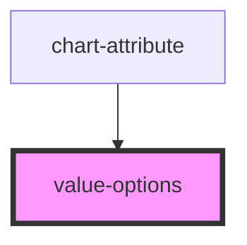

# my-component

<!-- Auto Generated Below -->

## Properties

| Property | Attribute | Description | Type     | Default |
| -------- | --------- | ----------- | -------- | ------- |
| `config` | --        |             | `object` | `{}`    |

## Dependencies

### Used by

 - [chart-attribute](.)

### Graph

----------------------------------------------

*Built with [StencilJS](https://stenciljs.com/)*
